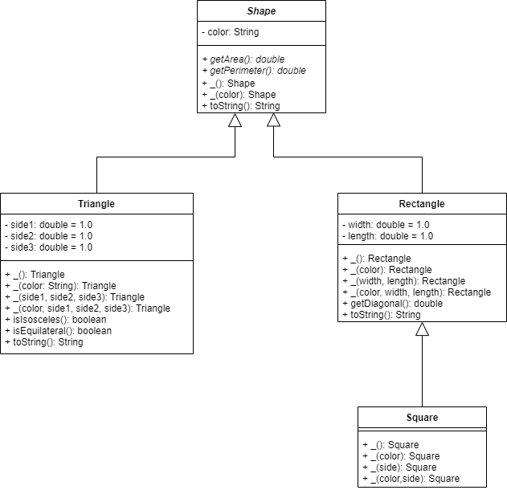
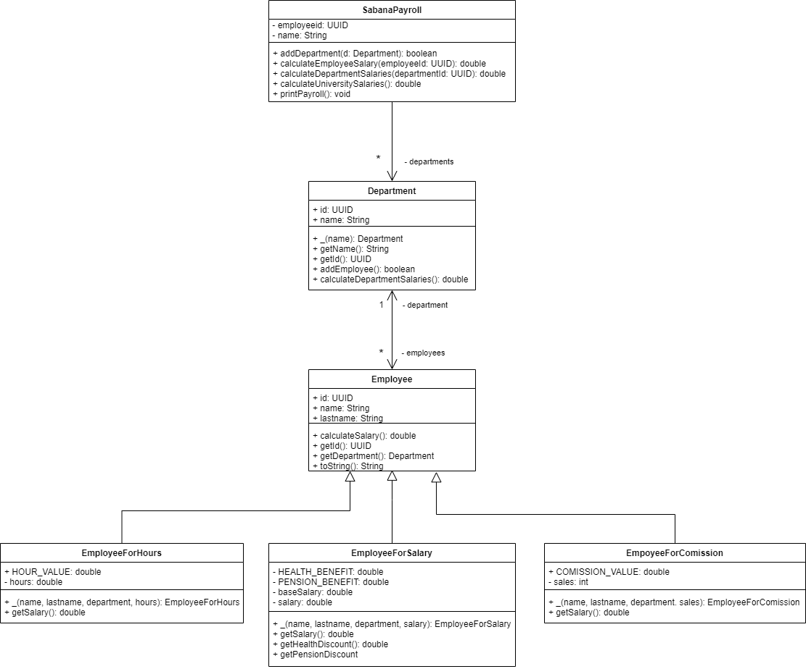
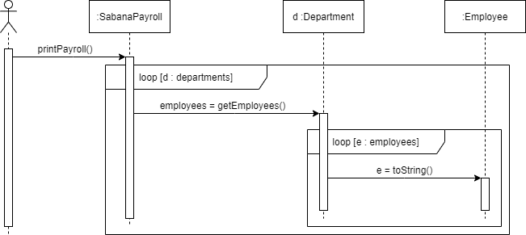
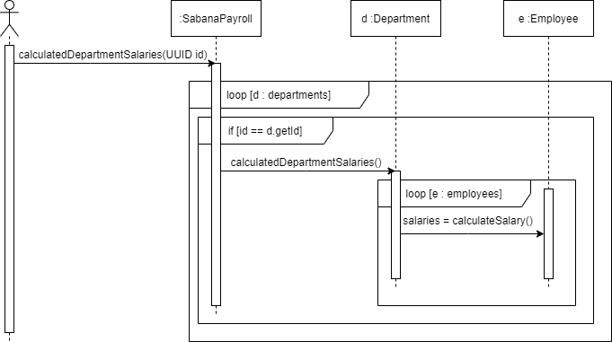
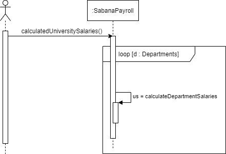
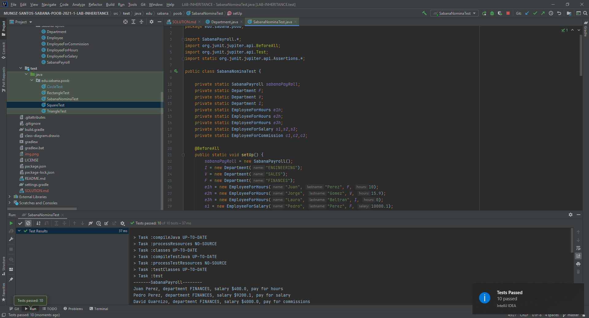
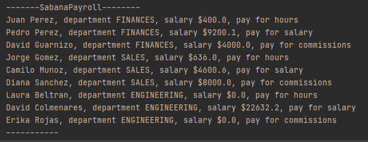

# SOLUTION LAB-INHERITANCE
## Parte I - Entendiendo herencia
### Evidencia

## Parte II - Implementando herencia
* La clase Employee puede ser abstracto.

  
  

## Parte III - Diseñando Herencia
### Diseño

## Parte IV - Herencia en un contexto
### Diseños
### `Diagrama de Clases`

### `Diseño printPayroll`

### `Diseño calculateEmployeeSalary`

### `Diseño calculateDepartmentSalaries`

### `Diseño calculateUniversitySalaries`

### Evidencias
### `Evidencia Test`

### `Imprimir la lista de empleados`
