# SOLUTION LAB-ABSTRACT-CLASS
## Parte I - Corrigiendo `Shapes`
### -Diagrama de clases
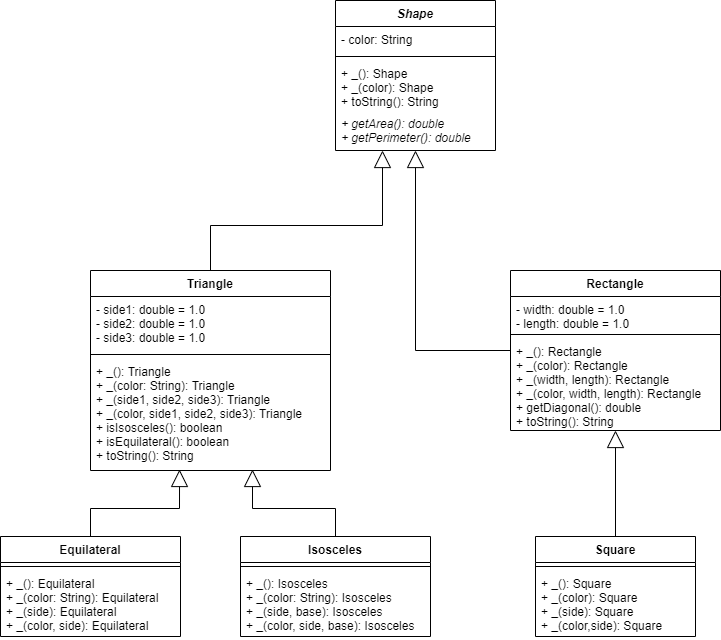
### -Ejecución de pruebas
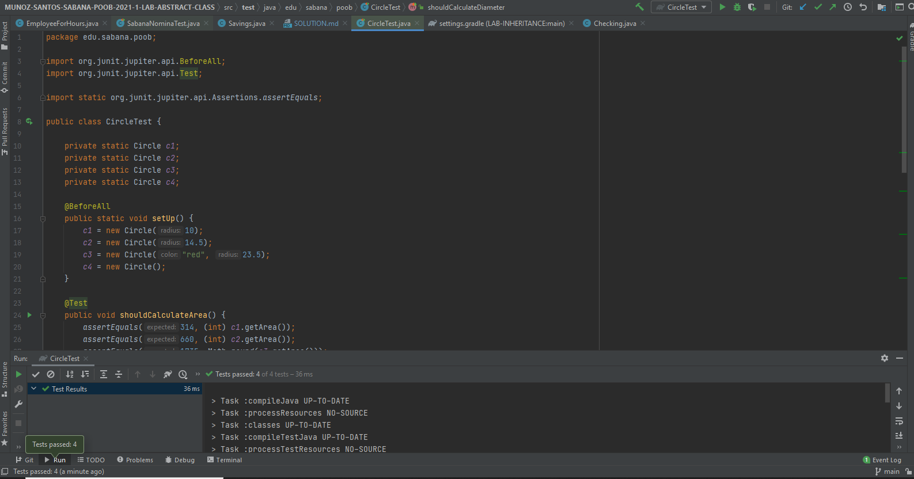
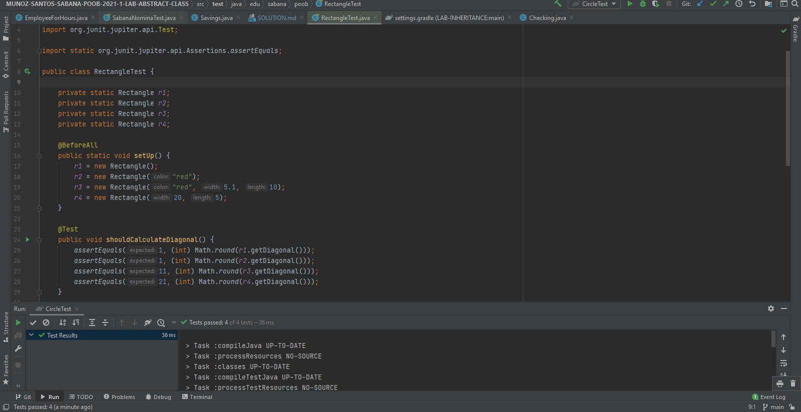
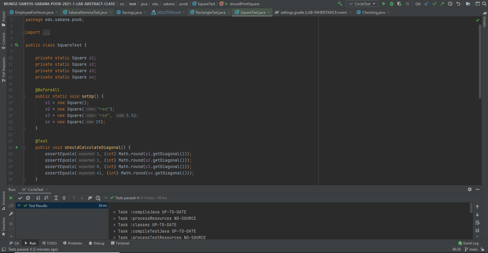
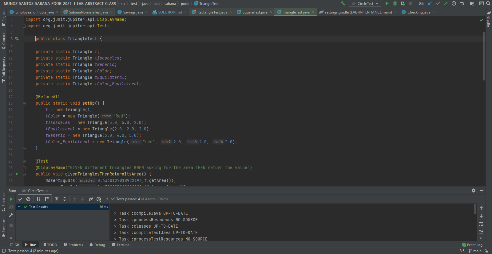
## Parte II - Corrigiendo `SabanaPayroll`
* La clase Employee puede ser abstracta.

  
  

## Parte IV - Clases Abstractas Integrando
### -Diagramas de secuencia
  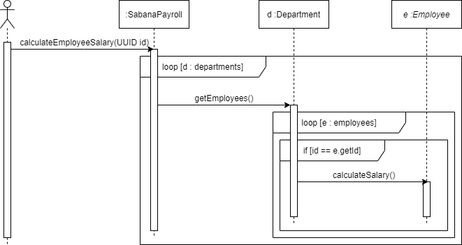
  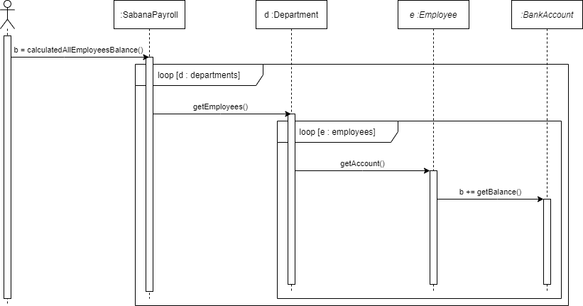
  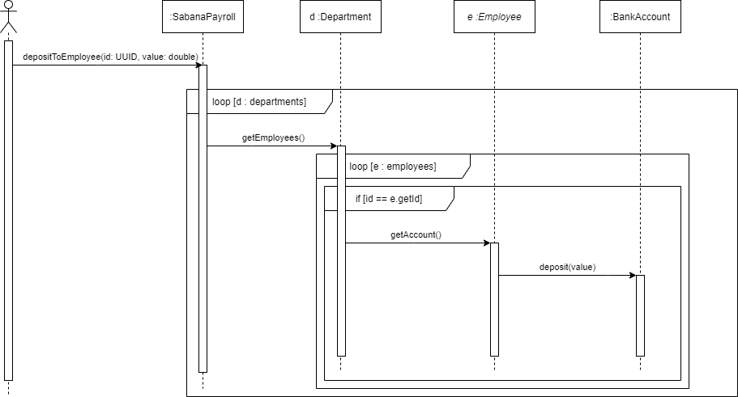
### -Diagrama de clases
  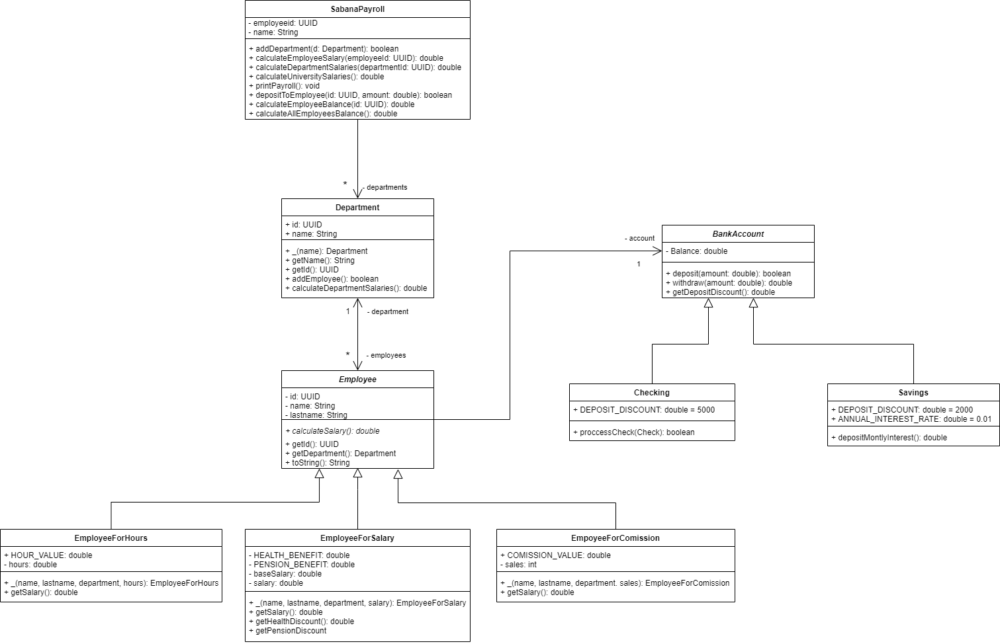
### -Ejecución de pruebas
  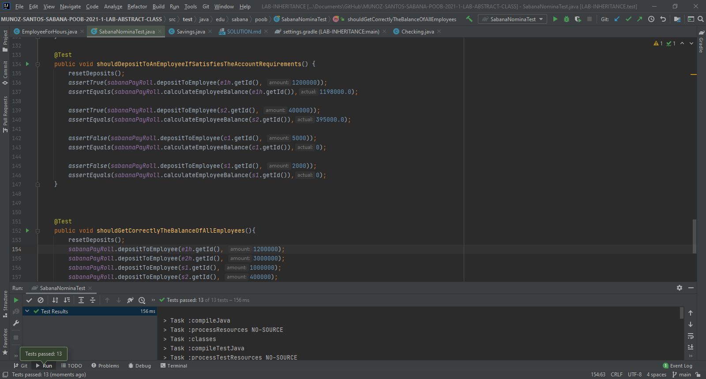
  

## Parte V - Clases Abstractas Diseñando en un contexto

### -Diagrama de clases

### -Diagramas de secuencia del método de `VacationBenefit`
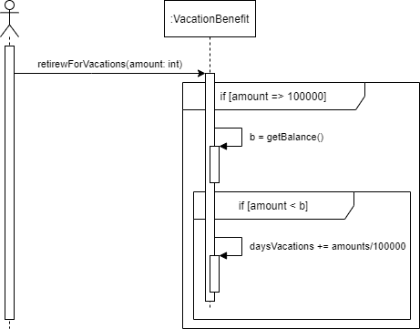
### -Diagramas de secuencia del método de `CourseBenefit`
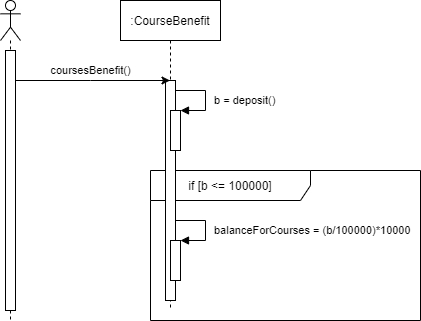